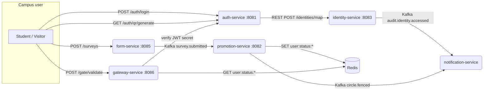

# Arquitectura de comunicación entre los 6 microservicios

| Canal                    | Producer            | Consumer            | Tipo  |
|--------------------------|---------------------|---------------------|-------|
| `audit.identity.accessed`| identity-service    | notification-service| Kafka |
| `survey.submitted`       | form-service        | promotion-service   | Kafka |
| `circle.fenced`          | promotion-service   | notification-service| Kafka |
| `/identities/map`        | auth-service        | identity-service    | REST  |
| `/gate/validate`         | client              | gateway-service     | REST  |
| `user:status:<id>`       | promotion-service   | gateway-service     | Redis |

Las pruebas de integración (punto 3.b) cubren cada uno de estos canales.
